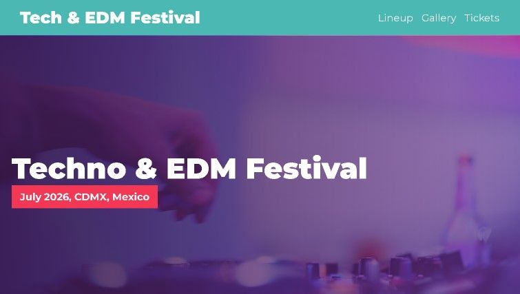
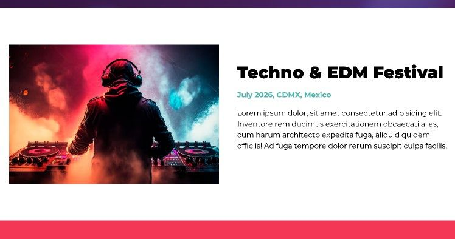
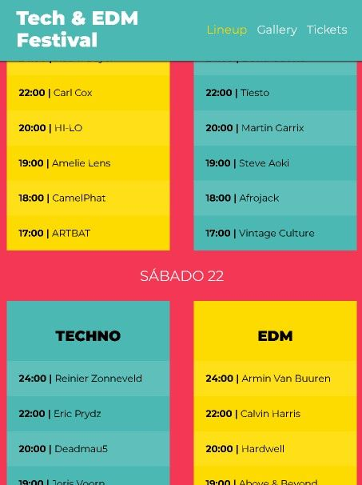
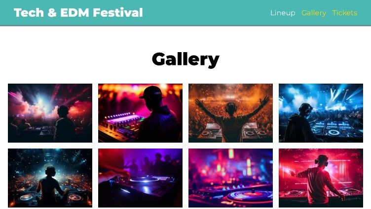
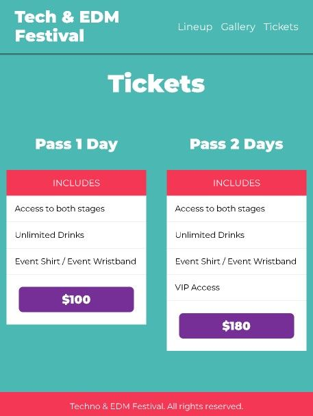

# Web Music Festival (FrontEnd)

## Introduction
This is a practice project to enhance my skills in HTML, CSS with SASS, and JavaScript, using Gulp as a tool to compile SASS and optimize image formats. The goal is to create a Music Festival website where you can read about the event, explore the lineup of concerts, view the gallery, and purchase tickets.
## Screenshots

<p align="center">
    <picture>
        <source srcset="build/img/screenshots/screenshot1.avif" type="image/avif">
        <source srcset="build/img/screenshots/screenshot1.webp" type="image/webp">
        
    </picture>
    <picture>
        <source srcset="build/img/screenshots/screenshot2.avif" type="image/avif">
        <source srcset="build/img/screenshots/screenshot2.webp" type="image/webp">
        
    </picture>
    <picture>
        <source srcset="build/img/screenshots/screenshot3.avif" type="image/avif">
        <source srcset="build/img/screenshots/screenshot3.webp" type="image/webp">
        
    </picture>
    <picture>
        <source srcset="build/img/screenshots/screenshot4.avif" type="image/avif">
        <source srcset="build/img/screenshots/screenshot4.webp" type="image/webp">
        
    </picture>
    <picture>
        <source srcset="build/img/screenshots/screenshot5.avif" type="image/avif">
        <source srcset="build/img/screenshots/screenshot5.webp" type="image/webp">
        
    </picture>
    <picture>
        <source srcset="build/img/screenshots/screenshot6.avif" type="image/avif">
        <source srcset="build/img/screenshots/screenshot6.webp" type="image/webp">
        
    </picture>

</p>


## Features
- Navigation bar with links to different sections.
- Hero section with background video

Section:
- About festival.
- Line up.
- Gallery whit JS.
- Ticket.

## Technologies
   
 

## Installation

1. Clone this repository:
```bash
git clone https://github.com/FernandoMercado-Dev/web_MusicFestival-EN.git
```
2. Navigate to the project folder
3. Install the project dependencies (Node.js and npm required):
```bash
npm install
```
4. In case of a change, to compile and run the project, use the following command:
```bash
npm run dev
```
5. Open the index.html file